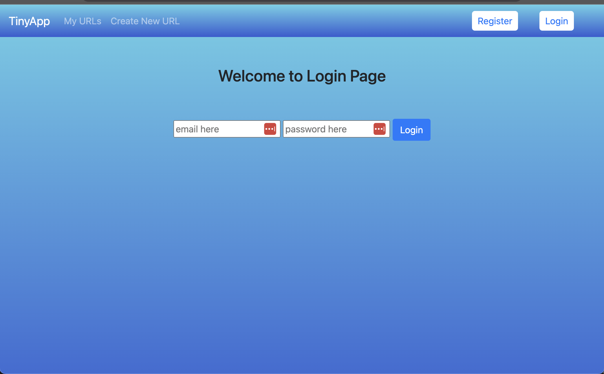

# TinyApp Project

TinyApp is a full stack web application built with Node and Express that allows users to shorten long URLs (à la bit.ly).

## Final Product

## Dependencies

- Node.js
- Express
- EJS
- bcryptjs
- cookie-session
- method-override

## Getting Started

- Install all dependencies (using the `npm install` command).
- Run the development web server using the `npm start` command.

## Using Tiny App

1. Start by creating a new account on the /register page
   

2. Once an account has been created , you can log in with your specified email and password.
   

3. Once you log in. You will be prompted to the /urls/
   where you can find your custom shortned urls.
   This will be empty the first time you log in since you havnt created any so far
   

4. To create your first URL. Click the : Create new URL button which should prompt you to this screen
   

5. Once you have chosen your desired URL. You will be prompted to a window with information about that specific URL. You can see how many total clicks came from your shortned URL and how many UNIQUE people have looked at your URL. If you wish to edit your destination URL you can edit it to whatever you like. Clicking on the short URL will send you to your destination.

   _please read disclaimer for editing rules_
   

6. At this point your URL homescreen should have your custom URL. Congratulations! Happy shortening!

